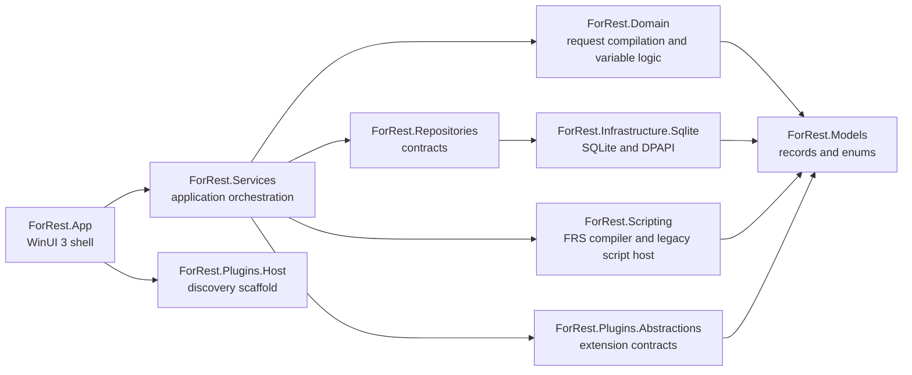

# For-Rest Architecture

Date: 2026-03-17

## Intent

The initial architecture is designed to ship a local-only Windows REST workbench without painting the product into a corner. The current codebase prioritizes clean boundaries, a workable WinUI shell, a testable HTTP pipeline, and isolated seams for scripting and future plugins.

## System Shape

## Layer Responsibilities

### Presentation

[`src/ForRest.App`](../../src/ForRest.App)

- Hosts the WinUI 3 shell, resource dictionary, and view models.
- Projects service results into a three-pane desktop layout.
- Handles user interactions, theme application, and pane-level state.
- Does not own HTTP rules, variable precedence, storage rules, or scripting behavior.

### Application Services

[`src/ForRest.Services`](../../src/ForRest.Services)

- Coordinates the request execution pipeline.
- Seeds the initial workspace state.
- Runs repeat execution schedules.
- Bridges repositories, domain logic, and the script host.

### Domain

[`src/ForRest.Domain`](../../src/ForRest.Domain)

- Resolves variable precedence.
- Compiles request definitions into executable requests.
- Formats and validates JSON.
- Extracts runtime variables from response payloads.

### Persistence

[`src/ForRest.Repositories`](../../src/ForRest.Repositories)

- Defines repository contracts exposed upward.

[`src/ForRest.Infrastructure.Sqlite`](../../src/ForRest.Infrastructure.Sqlite)

- Implements local persistence with SQLite.
- Stores app state and execution history.
- Protects secrets with DPAPI before persistence.

### Scripting

[`src/ForRest.Scripting`](../../src/ForRest.Scripting)

- Parses and compiles the `.frs` request-document language into execution payloads.
- Produces runtime variable seed operations, extraction definitions, retry metadata, and generated assertion scripts.
- Still hosts the Roslyn-backed execution adapter used by the current runtime for generated assertions and legacy script hooks.
- Keeps authoring and execution payload preparation away from UI types and repository concerns.

### Extensibility

[`src/ForRest.Plugins.Abstractions`](../../src/ForRest.Plugins.Abstractions)

- Defines future extension points without leaking app internals.

[`src/ForRest.Plugins.Host`](../../src/ForRest.Plugins.Host)

- Provides manifest/discovery scaffolding for later plugin enablement.

## Execution Pipeline

The current send flow follows this order:

1. Resolve variables from system, global, workspace, environment, request-local, and runtime scopes.
2. Evaluate `.frs` runtime seed variables when the request originated from a script document.
3. Compile the request into a normalized `PreparedRequest`.
4. Execute the pre-request script when legacy request hooks are present.
5. Send the HTTP request with per-request redirect, timeout, SSL, and retry settings.
6. Capture the response snapshot and raw response text.
7. Run configured extraction rules.
8. Execute the generated or legacy post-response assertions and collect test and console output.
9. Persist execution history when enabled.
10. Project the latest execution result back to the UI.

## Storage Strategy

- SQLite is the durable store for workspaces, requests, environments, execution history, and profile-level state.
- Secret values are DPAPI-protected before serialization into the SQLite payload.
- The current schema is intentionally small:
  - `app_state`
  - `execution_history`
- Schema versioning and migrations are a next-step concern and should not be skipped before broader feature expansion.

## UI Shell

The current shell is a pragmatic MVP shell:

- custom title bar and custom top request strip for workspace, environment, method, URL, send, save, and JSON actions
- left pane for workspace explorer and history
- middle pane for request authoring tabs
- right pane for response, console, tests, and extracted variables

The shell is intentionally using stock WinUI controls for now. This keeps the app buildable and usable while leaving room for a dedicated editor-hosting subsystem, which is still required for the final product quality bar.

The design target has sharpened:

- denser IDE-like pane chrome rather than generic app spacing
- utilitarian adjustable panes rather than fixed-width sections
- stronger semantic accents for methods, states, and execution context
- editor surfaces that feel like developer tooling, not business forms
- a slightly modern-futuristic Windows-native tone without drifting into gimmicks

See [`docs/architecture/ui-direction.md`](ui-direction.md) for the explicit shell and editor direction.

## Theming

- Theme resources are centralized in [`src/ForRest.App/App.xaml`](../../src/ForRest.App/App.xaml) and applied by [`src/ForRest.App/App.xaml.cs`](../../src/ForRest.App/App.xaml.cs).
- The current palette already distinguishes background, panel, border, accent, success, warning, error, and HTTP method colors.
- Theme expansion is still needed to cover a fuller token system and editor syntax theme pairing.

## Security and Trust Boundaries

- Secrets are protected at rest through DPAPI.
- SSL validation is exposed as an explicit request setting.
- Scripts are trusted local automation and run with deliberate power; they are not sandboxed.
- Plugins are treated as future trusted local extensions and remain scaffold-only for now.

## Test Posture

[`tests/ForRest.Tests`](../../tests/ForRest.Tests)

Current automated coverage includes:

- variable precedence and template rendering
- request compilation and auth handling
- request execution against a local loopback HTTP listener, including verb, headers, body, and response capture
- JSON formatting and validation
- response extraction
- `.frs` language parse/compile behavior
- script host behavior
- repeat runner scheduling behavior
- SQLite repository persistence and secret protection
- workspace seeding behavior

UI automation and persistence migration testing remain future work.

## Recommended Near-Term Decisions

1. Lock the editor-hosting strategy with a dedicated ADR.
2. Add explicit schema versioning before broadening persistence scope.
3. Define plugin API versioning and trust UX before enabling third-party loading.
4. Formalize theme tokens and shell chrome conventions beyond the initial resource dictionary.
